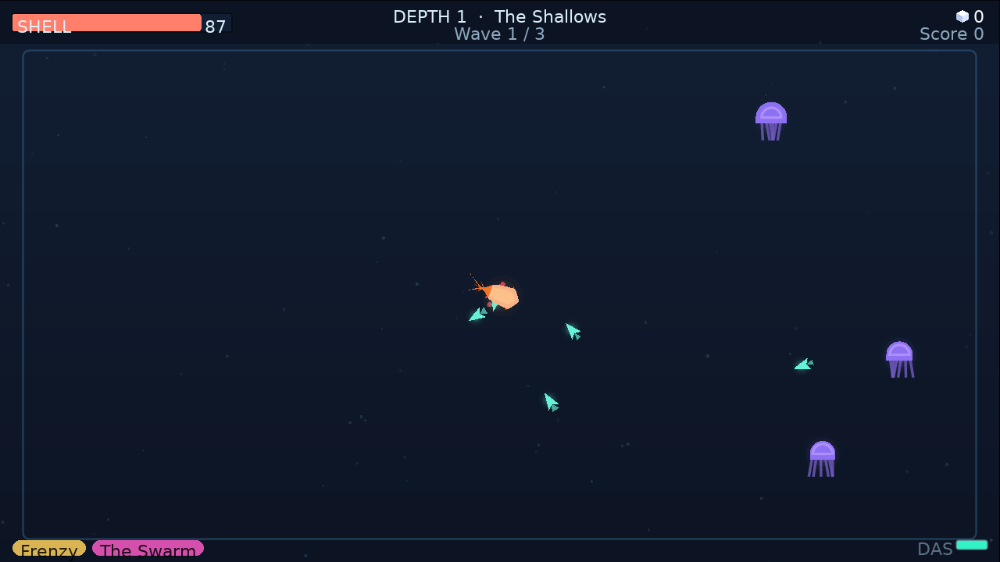
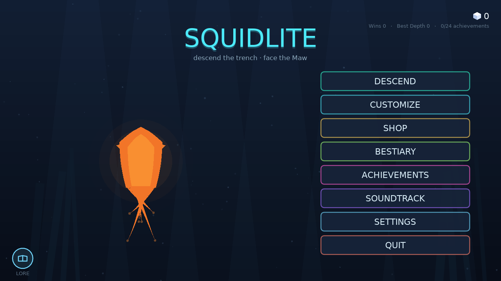
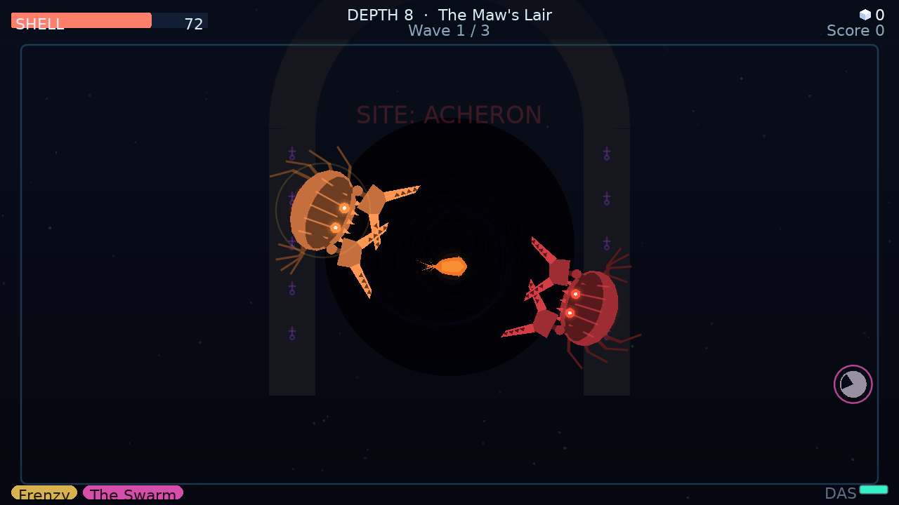
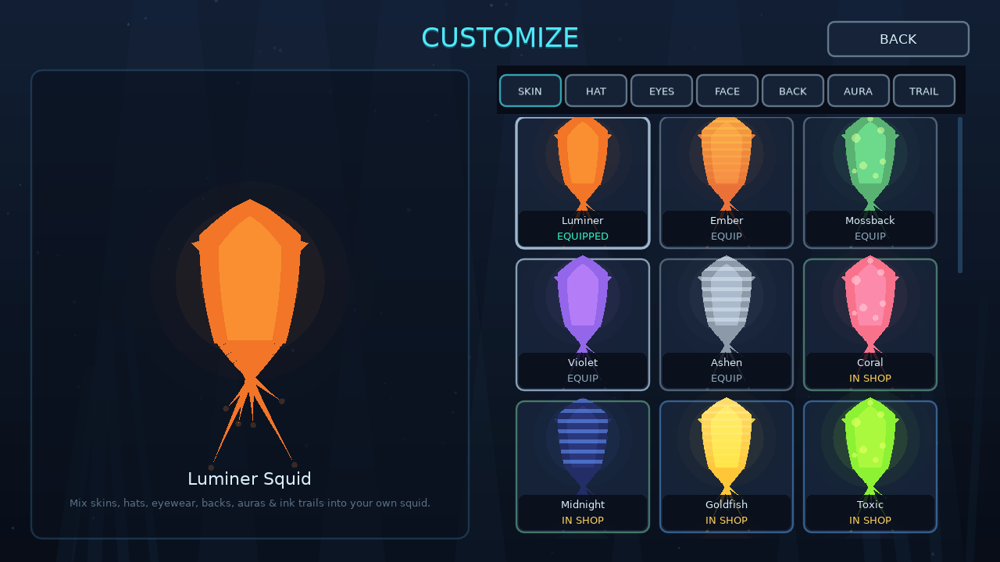
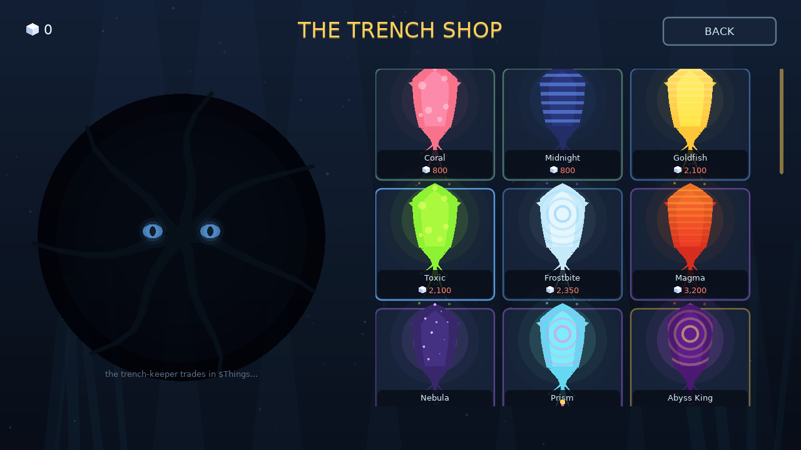
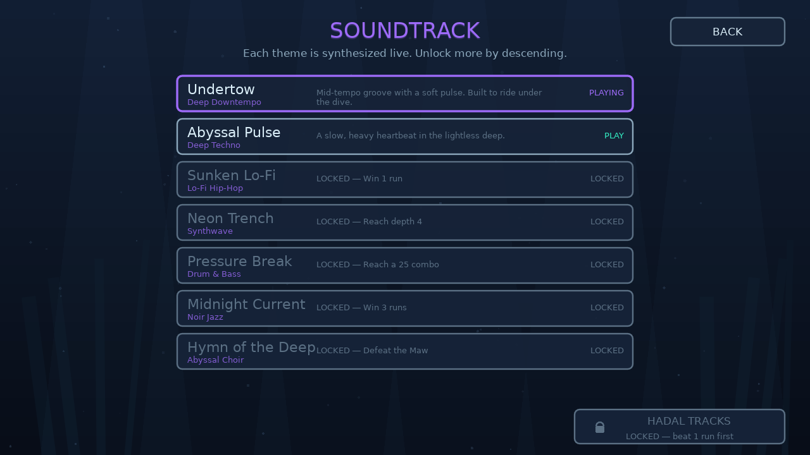
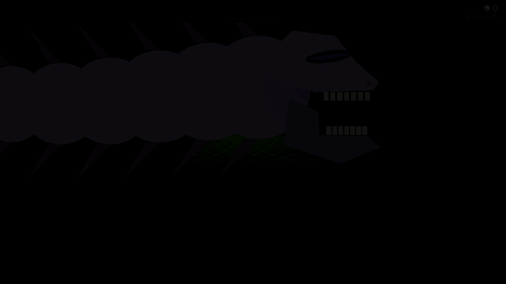

# Squidlite

A bioluminescent deep-sea **roguelite** built in [LÖVE](https://love2d.org) (Lua).
You are the last lit squid; the Maw has drunk the light from the ocean. Descend
eight depths of the trench, ink the dark, and take back the sea.

Squidlite is the spiritual successor to my previous roguelite shooter,
**Claude: Mythos** — carrying forward its run-based combat and roguelite loop
into the deep sea.

> Requires LÖVE 11.x. Run from this folder with: `love .`

## Screenshots

The Shallows — jet around, ink the dark, dodge the drift:



| | |
| --- | --- |
|  |  |
|  |  |

Pick from a live-synthesized procedural soundtrack:



...and something passes in the deep.



## The story
The sea drank the light. The **Maw** woke beneath the Hadal Trench and began to
swallow the glow, reef by reef, until only one lit squid remained — you. Eight
depths lie between your ink and the thing that ate the light.

## Controls
| Action | Keys |
| --- | --- |
| Move (jet propulsion) | `WASD` / Arrows |
| Aim | Mouse |
| Shoot ink | Left mouse (hold) |
| Dash / jet boost | `Space` / `Shift` / Right mouse |
| Pause | `Esc` |
| Pick mutation | `1` `2` `3` or click |
| Fullscreen | `F11` |
| Debug console (FPS + logs) | `F9` |

## What's in it
- **Unique squid combat** — momentum jet movement, ink shooting, a dash
  that can leave damaging ink clouds. Dodge bullet-hell from bosses.
- **8 depths, 8 unique enemies** (Drifter, Darter, Snapper, Spitter, Lurker,
  Gulper, Puffer, Wisp), each with its own AI, plus stronger **Abyssal variants**
  and two bosses — the **Warden** and the final **Maw**.
- **In-run mutations** — pick 1 of 3 upgrades between depths (split streams,
  homing ink, ink veil, vampire squid, ricochet, berserk, and more).
- **Run modifiers** — *Perils* make the trench deadlier and pay MORE; *Mercies*
  make it gentler and pay LESS. Your payout is multiplied by everything you stack.
- **$Things currency** — earned from each run, balanced by how deep you got, kills,
  whether you won, and your modifier multiplier.
- **Character customization** — mix **skins** + **accessories** (hats, eyewear,
  faces, backs, auras, ink trails) into your own squid. Basics are free; many are
  bought in the shop; the best are locked behind **achievements**.
- **The Trench Shop** — a kraken in the void trades skins for $Things (and gets
  very excited when you buy something).
- **Procedural soundtrack** — six live-synthesized themes across genres
  (abyssal ambient, lo-fi, synthwave, drum & bass, noir jazz, abyssal choir),
  unlocked as you progress.
- **17 achievements**, persistent save, and a Settings screen with a
  letterboxed fullscreen toggle (never stretched — black bars) and a guarded
  data-reset flow.
- **Super Secret Settings** — enter the Konami code on a menu
  (`↑ ↑ ↓ ↓ ← → ← → B A`) for a pile of silly, purely-visual shader filters.

## Project layout
```
conf.lua            window + identity
main.lua            shell: letterbox scaling, state routing, post-FX, debug console
src/
  util.lua          math/draw helpers
  palette.lua       shared abyssal colors
  save.lua          persistent profile (serialized Lua table)
  squid.lua         the customizable squid renderer (skins + accessories)
  cosmetics.lua     skins + accessories catalog + ownership
  achievements.lua  achievement catalog + unlocking
  modifiers.lua     run perils/mercies + payout aggregation
  upgrades.lua      in-run mutation pool
  enemies.lua       bestiary, AI, variants, bosses
  bullet.lua        projectiles (ink + enemy)
  particles.lua     particle pool / marine snow
  player.lua        the in-game player squid
  game.lua          a run: waves, depths, scoring, payout
  ui.lua            all menus (incl. shop, customize, secret settings)
  audio.lua         procedural SFX + music synthesis
  secretfx.lua      Super Secret Settings catalog
  debuglog.lua      F9 console log ring-buffer
```

## Developer tools
- `love . selftest` — headless smoke test that drives every screen and a full
  run lifecycle, then prints `SELFTEST OK` / failure trace.
- `love . shot` — renders every screen to PNGs in the LÖVE save directory.
